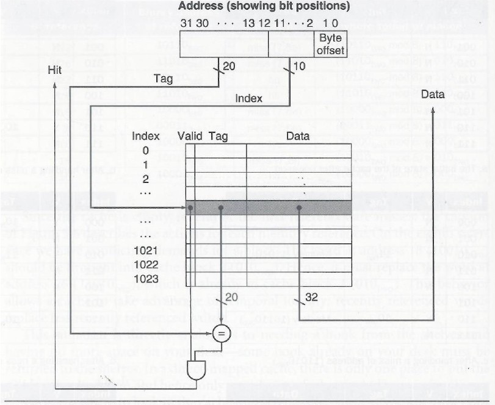

# Cache

### Introduction
          I n hierarchy memory system The cache is a fast but small SRAM (static random
      access memory) that stores recently using data It tries to “guess” and store the data
      that will be used by the processor in the near future. When the processor issu es
      memory instruction s, e.g. lw or sw , t he cache could save long DRAM (dynamic
      random access memory) latency , if the data is found in the cache, so called cache hit .
      If th e data does not in the cache , i.e. cache miss, the processor must wait for an
      a dditional cache miss penalty. Since the latency of DRAM is hundred times slower
      than that of SRAM, the cache hit rate , i.e. the hit count becomes a critical factor
      of overall system performance. Thus, for decades, computer architects have develop ed
      many cache policies and tried to identify those recently using data that will be
      accessed in the near future to improve the cache hit rate
      
          There are several cache related performance policies, including cache allocation
      policies, cache replacement policies , cache write policies , cache indexing schemes,
      etc. All of them have significant impact on the cache performance. In this project, we
      are going to implement a cache behavior simulator targeting specific cache policies.
      Given a series of memory accesses, a cache configuration (including cache capacity,
      number of cache associative, etc.). Your program should trace the cache behavior and
      report the cache performance.
      
      

